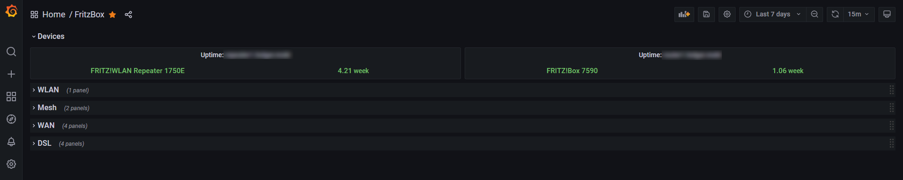

## About fritzbox-telegraf-plugin
This [Telegraf](https://github.com/influxdata/telegraf) input plugin gathers stats from [AVM](https://avm.de/) FRITZ!Box devices. It uses the device's [TR-064](https://avm.de/service/schnittstellen/) interfaces to retrieve the stats. DSL routers as well as WLAN repeaters are supported.

### Installation
To install the plugin you have to download the release archive and extract it or clone the repository. Afterwards build the plugin via a simple
```
make
```
Go version 1.16 or higher is required to build the plugin. The resulting plugin binary will be written to **./bin**. Copy the plugin binary to a location of your choice (e.g. /usr/local/lib/telegraf/)

### Configuration
This is an [external plugin](https://github.com/influxdata/telegraf/blob/master/docs/EXTERNAL_PLUGINS.md) which has to be integrated via Telegraf's [excecd plugin](https://github.com/influxdata/telegraf/tree/master/plugins/inputs/execd).

To use it you have to create a plugin specific config file (e.g. /etc/telegraf/fritzbox.conf) with following template content:
```toml
[[inputs.fritzbox]]
  ## The fritz devices to query (multiple triples of base url, login, password)
  devices = [["http://fritz.box:49000", "", ""]]
  ## The http timeout to use (in seconds)
  # timeout = 5
  ## Process Device services (if found)
  # get_device_info = true
  ## Process WLAN services (if found)
  # get_wlan_info = true
  ## Process WAN services (if found)
  # get_wan_info = true
  ## Process DSL services (if found)
  # get_dsl_info = true
  ## Process PPP services (if found)
  # get_ppp_info = true
  ## The cycle count, at which low-traffic stats are queried
  # full_query_cycle = 6
  ## Enable debug output
  # debug = false
```
The most important setting is the **devices** line. It defines the base URLs of devices to query as well as the credentials (login + password) to use for authentication. At least one device has to be defined.
The flags (**get_*_info**) control which stats are polled and are described in the sections below.

To enable the plugin within your Telegraf instance, add the following section to your **telegraf.conf**
```toml
[[inputs.execd]]
  command = ["/usr/local/lib/telegraf/fritzbox-telegraf-plugin", "-config", "/etc/telegraf/fritzbox.conf", "-poll_interval", "10s"]
  signal = "none"
```
The polling interval defined here interacts with the **full_query_cycle** option above. The plugin gathers it's stats every 10s. Every 6th run (60s) it performs all configured queries. In between only the WAN stats are queried. By adapting the two options **poll_interval** and **full_query_cycle** you control the update frequency as well as the resulting system load.

#### Device Info (get_device_info)
Reports the **fritzbox_device** measurement:
```
fritzbox_device,fritz_device=fritz.box,service=DeviceInfo1 uptime=773607i,model_name="FRITZ!Box 7590" 1647203021364800000
```
The uptime (in seconds) as well as the model name are reported for every configured device.



#### WLAN Info (get_wlan_info)
Reports the **fritzbox_wlan** measurement:
```
fritzbox_wlan,access_point=fritz.box:MySSID:11,fritz_device=fritz.box,service=WLANConfiguration1 total_associations=2i 1647203147521085000
fritzbox_wlan,access_point=fritz.box:MySSID:44,fritz_device=fritz.box,service=WLANConfiguration2 total_associations=7i 1647203148048754000
```
For every device and every configured WLAN (2.4 GHz and 5 GHz are considered separate WLANs here) a stats line is created reporting the number of currently associated clients.


#### WAN Info (get_wan_info)
Reports the **fritzbox_wan** measurement:
```
fritzbox_wan,fritz_device=fritz.box,service=WANCommonInterfaceConfig1 layer1_downstream_max_bit_rate=240893000i,upstream_current_max_speed=6255i,downstream_current_max_speed=8027i,total_bytes_sent=31387049656i,total_bytes_received=214361402812i,layer1_upstream_max_bit_rate=49741000i 1647203434928636000
```
The current stats of the WAN link are reported (bandwidth, current rates, transfered bytes, ...).


#### DSL Info (get_dsl_info)
Reports the **fritzbox_dsl** measurement:
```
fritzbox_dsl,fritz_device=fritz.box,service=WANDSLInterfaceConfig1 downstream_power=515i,receive_blocks=181681151i,cell_delin=0i,errored_secs=4i,atuc_hec_errors=0i,upstream_max_rate=49741i,downstream_attenuation=140i,link_retrain=1i,crc_errors=6i,downstream_max_rate=240893i,downstream_noise_margin=110i,transmit_blocks=78704877i,init_errors=0i,loss_of_framing=0i,severly_errored_secs=0i,fec_errors=0i,hec_errors=0i,downstream_curr_rate=236716i,upstream_attenuation=80i,upstream_power=498i,init_timeouts=0i,atuc_fec_errors=0i,atuc_crc_errors=1i,upstream_curr_rate=46719i,upstream_noise_margin=80i 1647203965519168000
```
The current statistics of the DSL line are reported.


#### PPP Info (get_ppp_info)
Reports the **fritzbox_ppp** measurement:
```
fritzbox_ppp,fritz_device=fritz.box,service=WANPPPConnection1 upstream_max_bit_rate=45048452i,downstream_max_bit_rate=56093007i,uptime=774164i 1647204091697400000
```
The current PPP stats are reported, especially the uptime (in seconds). The latter is shown in the WAN graph example above.

### License
This project is subject to the the MIT License.
See [LICENSE](../LICENSE) information for details.
